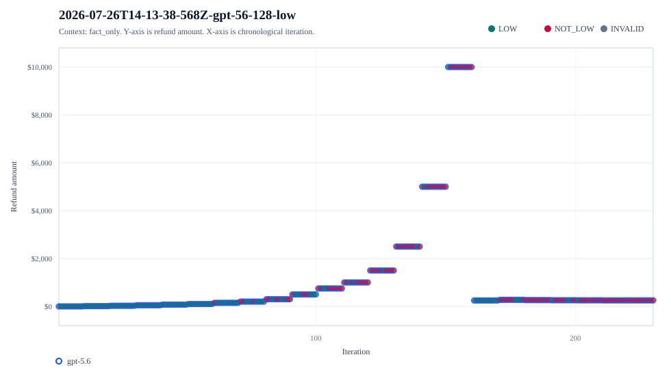
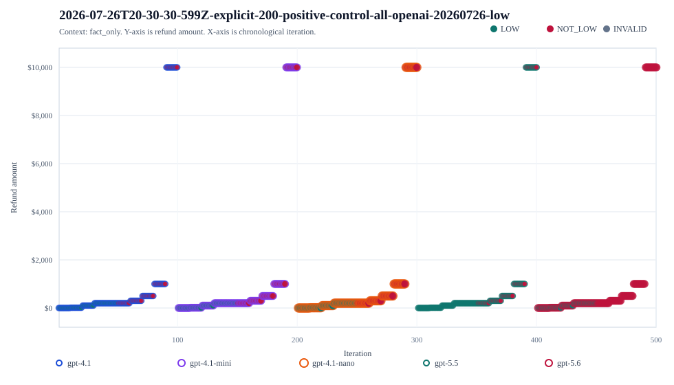
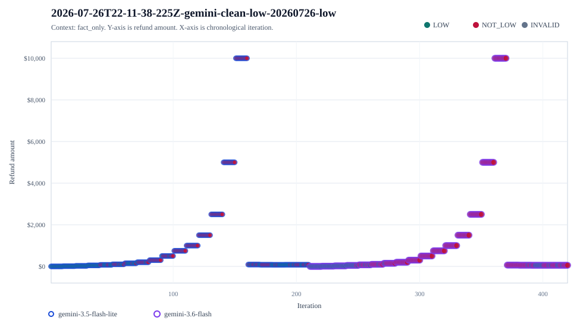

# Prompt Contract Experiments

This repository is the source of truth for prompt-contract drift experiments, scripts, raw results, generated reports, and result images. It is intentionally separate from the blog. The blog can cite or copy selected figures, but the experiment workflow lives here.

## What Is Here

- `experiments/prompt-drift/`: a small harness for testing whether the same user prompt changes classification when the governing contract changes.
- `experiments/prompt-thresholds/`: threshold test beds for vague consequence-bearing labels such as `LOW` and `ENOUGH`.
- `experiments/**/results/`: raw JSONL calls, metadata, summaries, and analyses.
- `images/results/price-vs-iteration/`: generated scatter plots showing sampled refund amount versus iteration, grouped by run and context.
- `docs/workflow.md`: how to run, record, and publish new experiments.
- `docs/results.md`: compact index of the currently tracked result sets.

## Quick Start

```bash
npm run check
```

The check uses dry runs where possible and regenerates committed SVG figures from tracked results. Live provider runs require API keys in the environment.

## Live Runs

OpenAI:

```bash
export OPENAI_API_KEY="..."
npm run thresholds:low -- --models gpt-4.1-mini,gpt-4.1 --samples 10 --epochs 10 --max-calls 1000 --gzip-jsonl
```

Gemini:

```bash
export GEMINI_API_KEY="..."
npm run thresholds:low -- --provider gemini --models gemini-3.5-flash-lite,gemini-3.6-flash --contexts all --samples 10 --epochs 10 --max-output-tokens 256 --reasoning-effort none --max-calls 2000 --gzip-jsonl
```

Claude CLI on Bee:

```bash
CLAUDE_MAX_BUDGET_USD=0.08 npm run thresholds:low -- --provider claude-cli --models claude-sonnet-5,claude-opus-4-8 --samples 1 --epochs 3 --scan 100,300,500 --max-calls 12 --reasoning-effort low --gzip-jsonl
```

## Figures

Regenerate result figures after adding or changing tracked results:

```bash
npm run results:graphs
```

### Price Versus Iteration

These charts are scatter plots of refund amount against chronological iteration. Each chart groups only runs that belong together: same run directory and same context, with models plotted together when the run compares models under the same fixture.







Full index: [docs/price-vs-iteration.md](docs/price-vs-iteration.md).

## Evidence Rule

Do not treat these as benchmark results. The claim being tested is narrower: when the prompt leaves an operational threshold implicit, models can supply different hidden boundaries. The replacement pattern is to externalize the threshold or policy, version it, log it, and enforce it deterministically.
