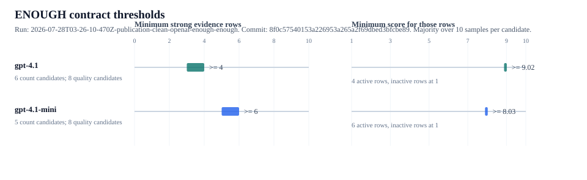
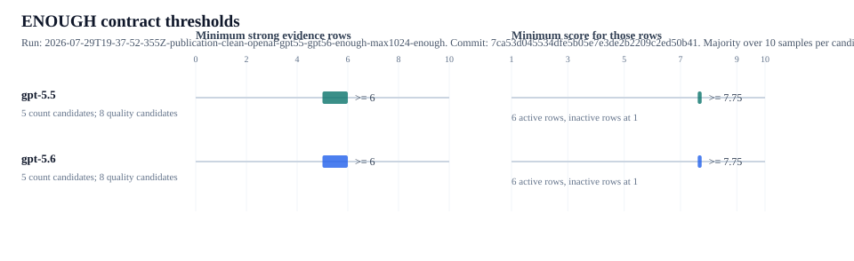

# ENOUGH Evidence Sufficiency

## 1. What This Experiment Shows

This experiment tests whether the label `ENOUGH` hides a sufficiency policy inside model judgment. The model sees ten evidence signals with numeric scores and must return `ENOUGH` or `NOT_ENOUGH`.

The claim is narrow. The experiment does not recover the model's real internal rule. It probes one observable surface: how many strong evidence rows are needed, and how strong those rows must be, before the model usually returns `ENOUGH`.

## 2. How It Works

- Runnable script: [src/enough.mjs](../../src/enough.mjs)
- Shared provider and result harness: [src/shared/harness.mjs](../../src/shared/harness.mjs)
- Prompt spec: [specs/enough.md](../../specs/enough.md)

The article run uses `--mode contract`, which has two phases. Phase 1 binary-searches the minimum number of strong evidence rows, using active rows scored `10` and inactive rows scored `1`. Phase 2 fixes that active-row count and binary-searches the minimum active-row score. Candidate row order is rotated across samples to reduce fixed-position bias.

The important files are `userPrompt()` for the ten evidence rows, `searchEvidenceCount()` for the row-count search, `searchQuality()` for the active-row score search, and the shared provider payload builders in `src/shared/harness.mjs`.

## 3. Results





The latest clean result directories are stored under [results/](results/):

- [OpenAI gpt-4.1 and gpt-4.1-mini](results/2026-07-28T03-26-10-470Z-publication-clean-openai-enough-enough/)
- [OpenAI gpt-5.5 and gpt-5.6](results/2026-07-29T19-37-52-355Z-publication-clean-openai-gpt55-gpt56-enough-max1024-enough/)
- [Gemini 3.5 and 3.6](results/2026-07-28T03-20-39-966Z-publication-clean-gemini-enough-enough/)

Each run directory contains `calls.jsonl`, `metadata.json`, `enough-thresholds.json`, `enough-thresholds.md`, `summary.csv`, `summary.md`, `analysis.md`, `system-prompt.txt`, `user-template.txt`, and `fixture.json`. Raw calls are the durable evidence; the other files are generated summaries and fixtures.

Full figure index: [docs/enough-thresholds.md](../../docs/enough-thresholds.md).

| Model | Provider | Minimum strong rows | Score band for those rows | Threshold score | Notes |
| --- | --- | ---: | --- | ---: | --- |
| `gpt-4.1` | `openai` | 4 | 8.875 to 9.016 | 9.016 | 4 active rows; inactive rows at 1 |
| `gpt-4.1-mini` | `openai` | 6 | 7.891 to 8.032 | 8.032 | 6 active rows; inactive rows at 1 |
| `gpt-5.5` | `openai` | 6 | 7.61 to 7.75 | 7.75 | 6 active rows; inactive rows at 1 |
| `gpt-5.6` | `openai` | 6 | 7.61 to 7.75 | 7.75 | 6 active rows; inactive rows at 1 |
| `gemini-3.5-flash-lite` | `gemini` | 6 | 9.719 to 9.86 | 9.86 | 6 active rows; inactive rows at 1 |
| `gemini-3.6-flash` | `gemini` | 6 | 7.891 to 8.032 | 8.032 | 6 active rows; inactive rows at 1 |

Run note: the GPT 5.x run uses `--max-output-tokens 1024`, matching the clean LOW rerun. The publication run has 260 raw calls, 0 invalid labels, 0 truncations, and 0 request errors.

## 4. Conclusion

The experiment shows that `ENOUGH` behaves like an implicit sufficiency rule. If that rule controls approval, escalation, refusal, publication, or spend, it should be written as code or policy and versioned. The model can help extract or assess evidence, but the approval boundary should not be hidden inside a vague label.

## Reproduce

```bash
npm install
export OPENAI_API_KEY="..."
export GEMINI_API_KEY="..."
npm run thresholds:enough -- --models gpt-4.1-mini,gpt-4.1 --mode contract --samples 10 --epochs 7 --max-calls 400 --gzip-jsonl --label publication-clean-openai-enough
npm run thresholds:enough -- --models gpt-5.5,gpt-5.6 --mode contract --samples 10 --epochs 7 --converge-width 0.25 --max-output-tokens 1024 --max-calls 400 --gzip-jsonl --label publication-clean-openai-gpt55-gpt56-enough-max1024
npm run thresholds:enough -- --provider gemini --models gemini-3.5-flash-lite,gemini-3.6-flash --mode contract --samples 10 --epochs 7 --max-output-tokens 256 --reasoning-effort none --max-calls 400 --gzip-jsonl --label publication-clean-gemini-enough
npm run results:enough-thresholds
```
