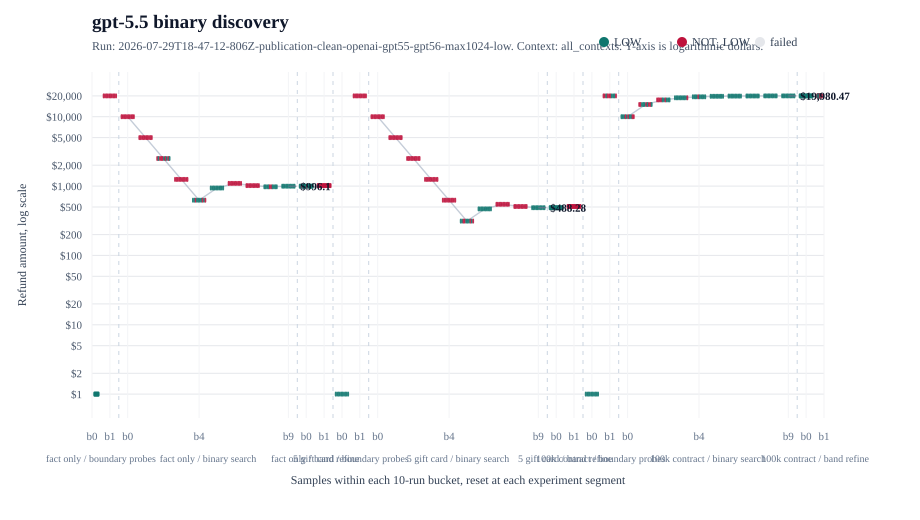

# LOW Retrieved Context

## 1. What This Experiment Shows

This experiment tests whether the label `LOW` hides an operational dollar threshold inside model judgment. The model sees the same refund case each time, but the surrounding retrieved context changes: no extra fact, a nearby `$5` gift-card note, or a nearby `$100,000` contract note.

The claim is narrow. This does not prove a universal threshold for any model. It shows that when a system lets the model decide what `LOW` means, nearby context can move the observed decision boundary while the actual refund case stays unchanged.

## 2. How It Works

- Runnable script: [src/low-retrieved-context.mjs](../../src/low-retrieved-context.mjs)
- Shared provider and result harness: [src/shared/harness.mjs](../../src/shared/harness.mjs)
- Prompt spec: [specs/low.md](../../specs/low.md)
- Retrieved-context fixture: [specs/low-retrieved-context.md](../../specs/low-retrieved-context.md)

The script runs a bounded binary search over refund amounts from `$0` to `$20,000`. At each candidate amount, it samples the model multiple times and estimates `P(LOW | amount)`. The search narrows the band around the point where `P(LOW)` crosses the target probability, then adds more samples at the final low and high endpoints.

The important files are `userPrompt()` for context injection, `runAdaptiveBandSearch()` for the probability-band search, and `buildOpenAiPayload()` / `buildGeminiPayload()` for provider calls.

## 3. Results




The latest clean result directories are stored under [results/](results/):

- [OpenAI gpt-4.1 and gpt-4.1-mini](results/2026-07-28T00-02-02-696Z-publication-clean-openai-low/)
- [OpenAI gpt-5.5 and gpt-5.6](results/2026-07-29T18-47-12-806Z-publication-clean-openai-gpt55-gpt56-max1024-low/)
- [Gemini 3.5 and 3.6](results/2026-07-28T00-13-22-919Z-publication-clean-gemini-low/)

Each run directory contains `calls.jsonl`, `metadata.json`, `threshold-bands.json`, `threshold-bands.md`, `summary.csv`, `summary.md`, `analysis.md`, `system-prompt.txt`, `user-template.txt`, and `fixture.json`. Raw calls are the durable evidence; the other files are generated summaries and fixtures.

Full figure index: [docs/price-vs-iteration.md](../../docs/price-vs-iteration.md). Publication summary: [results/publication-summary.md](results/publication-summary.md).

| Context | Model | Provider | Estimated band | Midpoint | Lower P(LOW) | Upper P(LOW) | Width | Note |
| --- | --- | --- | ---: | ---: | ---: | ---: | ---: | --- |
| Fact only | `gpt-4.1` | `openai` | $156.25 to $175.78 | $166.02 | 70.0% | 26.7% | $19.53 | Estimated probability band. |
| Fact only | `gpt-4.1-mini` | `openai` | $156.25 to $175.78 | $166.02 | 53.3% | 3.3% | $19.53 | Estimated probability band. |
| Fact only | `gemini-3.5-flash-lite` | `gemini` | $78.13 to $97.66 | $87.9 | 80.0% | 23.3% | $19.53 | Estimated probability band. |
| Fact only | `gemini-3.6-flash` | `gemini` | $39.06 to $58.59 | $48.83 | 90.0% | 30.0% | $19.53 | Estimated probability band. |
| Fact only | `gpt-5.5` | `openai` | $996.1 to $1,015.63 | $1,005.87 | 93.3% | 0.0% | $19.53 | Estimated probability band. |
| Fact only | `gpt-5.6` | `openai` | $97.66 to $117.19 | $107.43 | 100.0% | 13.3% | $19.53 | Estimated probability band. |
| $5 gift card context | `gpt-4.1` | `openai` | $0 to $19.53 | $9.77 | 100.0% | 50.0% | $19.53 | Estimated probability band. |
| $5 gift card context | `gpt-4.1-mini` | `openai` | $0 to $19.53 | $9.77 | 100.0% | 13.3% | $19.53 | Estimated probability band. |
| $5 gift card context | `gemini-3.5-flash-lite` | `gemini` | $39.06 to $58.59 | $48.83 | 63.3% | 0.0% | $19.53 | Estimated probability band. |
| $5 gift card context | `gemini-3.6-flash` | `gemini` | $0 to $19.53 | $9.77 | 100.0% | 0.0% | $19.53 | Estimated probability band. |
| $5 gift card context | `gpt-5.5` | `openai` | $488.28 to $507.81 | $498.04 | 100.0% | 0.0% | $19.53 | Estimated probability band. |
| $5 gift card context | `gpt-5.6` | `openai` | $39.06 to $58.59 | $48.83 | 70.0% | 16.7% | $19.53 | Estimated probability band. |
| $100k contract context | `gpt-4.1` | `openai` | >$20,000 in tested range |  | 100.0% | 100.0% | $20,000 | No crossing inside tested range. |
| $100k contract context | `gpt-4.1-mini` | `openai` | >$20,000 in tested range |  | 100.0% | 100.0% | $20,000 | No crossing inside tested range. |
| $100k contract context | `gemini-3.5-flash-lite` | `gemini` | $10,585.94 to $10,605.47 | $10,595.71 | 83.3% | 33.3% | $19.53 | Estimated probability band. |
| $100k contract context | `gemini-3.6-flash` | `gemini` | >$20,000 in tested range |  | 100.0% | 73.3% | $20,000 | No crossing inside tested range. |
| $100k contract context | `gpt-5.5` | `openai` | $19,980.47 to $20,000 | $19,990.24 | 100.0% | 46.7% | $19.53 | Estimated probability band. |
| $100k contract context | `gpt-5.6` | `openai` | >$20,000 in tested range |  | 100.0% | 66.7% | $20,000 | No crossing inside tested range. |


Binary-search example for the `gpt-5.6` `$5 gift card context` row above:

`P(LOW | amount)` means the observed share of calls that returned `LOW` for that amount. For example, `$39.06` returned `LOW` in `21` of `30` calls, so `P(LOW | $39.06) = 70.0%`. The search first samples broad midpoints, then spends extra calls only at the final band edges.

| Epoch | Amount | Search step | Calls | LOW | NOT_LOW | P(LOW) |
| ---: | ---: | --- | ---: | ---: | ---: | ---: |
| 0 | $0 | boundary low | 10 | 10 | 0 | 100.0% |
| 0 | $20,000 | boundary high | 10 | 0 | 10 | 0.0% |
| 1 | $10,000 | binary midpoint | 10 | 0 | 10 | 0.0% |
| 2 | $5,000 | binary midpoint | 10 | 0 | 10 | 0.0% |
| 3 | $2,500 | binary midpoint | 10 | 0 | 10 | 0.0% |
| 4 | $1,250 | binary midpoint | 10 | 0 | 10 | 0.0% |
| 5 | $625 | binary midpoint | 10 | 0 | 10 | 0.0% |
| 6 | $312.50 | binary midpoint | 10 | 0 | 10 | 0.0% |
| 7 | $156.25 | binary midpoint | 10 | 0 | 10 | 0.0% |
| 8 | $78.13 | binary midpoint | 10 | 2 | 8 | 20.0% |
| 9 | $39.06 | binary midpoint | 10 | 7 | 3 | 70.0% |
| 10 | $58.59 | binary midpoint | 10 | 1 | 9 | 10.0% |
| 11 | $39.06 | band refine | +20 | +14 | +6 | 70.0% cumulative |
| 11 | $58.59 | band refine | +20 | +4 | +16 | 16.7% cumulative |

That run used `160` calls for this model and context. A fixed `10`-call sample at only those same visited amounts would have used `120` calls, but it would not refine the final band edges. A fixed grid fine enough to guarantee the same `$19.53` spacing across `$0` to `$20,000` would require roughly `10,250` calls.
Run note: the GPT 5.x run uses `--max-output-tokens 1024`; a lower `256` budget was not used for publication because it could truncate the final label after reasoning tokens.

## 4. Conclusion

The experiment shows that `LOW` behaves like an implicit dollar policy. When the policy is left inside the prompt, nearby context can move the boundary. A production system should define the threshold outside the model, version it, log it, and use the model only for work that does not decide the threshold itself.

## Reproduce

```bash
npm install
export OPENAI_API_KEY="..."
export GEMINI_API_KEY="..."
npm run thresholds:low:retrieved-context -- --models gpt-4.1-mini,gpt-4.1 --contexts all --samples 10 --refine-samples 30 --epochs 10 --max 20000 --max-calls 2000 --gzip-jsonl --label publication-clean-openai
npm run thresholds:low:retrieved-context -- --models gpt-5.5,gpt-5.6 --contexts all --samples 10 --refine-samples 30 --epochs 10 --max 20000 --max-output-tokens 1024 --max-calls 2000 --gzip-jsonl --label publication-clean-openai-gpt55-gpt56-max1024
npm run thresholds:low:retrieved-context -- --provider gemini --models gemini-3.5-flash-lite,gemini-3.6-flash --contexts all --samples 10 --refine-samples 30 --epochs 10 --max 20000 --max-output-tokens 256 --reasoning-effort none --max-calls 2500 --gzip-jsonl --label publication-clean-gemini
npm run results:price-iteration
```
