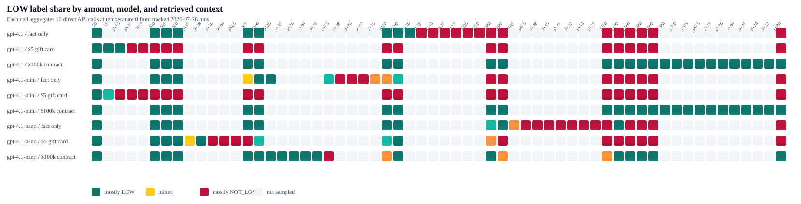
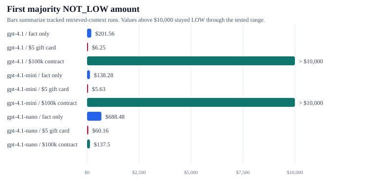

# Prompt Threshold Test Beds

These test beds support the article claim that prompts can hide operational contracts. They deliberately ask a model to classify consequence-bearing values with words such as `LOW` and `ENOUGH` without supplying the scalar or threshold that a production system would need.

The harness is intentionally plain:

- Direct provider API calls.
- No Meursault bridge, OpenClaw context, memory, or hidden prompt state.
- Exact fixtures and prompt templates are written into each run directory.
- Raw call records are JSONL.
- Summaries are generated from the raw records.
- Provider response model/version fields are stored when returned by the API.
- API keys must come from environment variables and are never written to disk by the harness.

## Visual Readme Graphs

The README keeps the visual proof lightweight: generated SVGs summarize tracked Git results without adding a dashboard to the article. Regenerate them after changing tracked run data:

```bash
npm run thresholds:graphs
```





These graphs use only the committed retrieved-context runs from 2026-07-26. The heatmap shows LOW versus NOT_LOW behavior at sampled amounts; the bar chart compresses the same evidence into the first majority NOT_LOW point per model/context. The point is not model benchmarking. It is a fast visual check that nearby retrieved context can move an implicit prompt boundary.

## Programs

```bash
npm run thresholds:low -- --models gpt-4.1-mini,gpt-4.1 --samples 10 --epochs 10 --max-calls 1000
npm run thresholds:enough -- --models gpt-4.1-mini,gpt-4.1 --samples 10 --epochs 10 --max-calls 1000
```

Dry runs write the same file structure without calling the API:

```bash
npm run thresholds:low:dry -- --models example-model
npm run thresholds:enough:dry -- --models example-model
```

Live OpenAI runs require:

```bash
export OPENAI_API_KEY="..."
```

Live Gemini runs require:

```bash
export GEMINI_API_KEY="..."
```

For a low-cost Gemini smoke test, prefer the stable Flash-Lite line first:

```bash
GEMINI_API_KEY="$GEMINI_API_KEY" npm run thresholds:low -- --provider gemini --models gemini-3.5-flash-lite,gemini-3.6-flash --samples 1 --epochs 3 --scan 100,300,500 --max-calls 12 --max-output-tokens 32 --label gemini-low-20260726 --gzip-jsonl
```

For a comparable Gemini run using the same sampling depth as the primary OpenAI confirmations:

```bash
GEMINI_API_KEY="$GEMINI_API_KEY" npm run thresholds:low -- --provider gemini --models gemini-3.5-flash-lite,gemini-3.6-flash --contexts all --samples 10 --epochs 10 --max-output-tokens 256 --reasoning-effort none --max-calls 2000 --label gemini-clean-low-20260726 --gzip-jsonl
```

Gemini rows store the requested model and the API response model/version when Google returns one. Comparable runs should use the same sample count, contexts, search depth, output cap, and reasoning setting as the primary OpenAI fixtures.

Low-cost Claude CLI runs can use the authenticated Claude Code session on `eric-bee`:

```bash
CLAUDE_MAX_BUDGET_USD=0.08 npm run thresholds:low -- --provider claude-cli --models claude-sonnet-5,claude-opus-4-8 --samples 1 --epochs 3 --scan 100,300,500 --max-calls 12 --reasoning-effort low --label claude-cli-pinned-low-20260726 --gzip-jsonl
```

Claude CLI records must be read with care: the requested model and the response model reported by Claude Code can differ at `low` effort. The raw JSONL rows store both fields.

## `low`

Primary fixture: fact-only refund amount classification. The prompt asks whether `$X` is `LOW` or `NOT_LOW` and gives no dollar threshold.

Default search method:

```text
bounded binary band search over $0..$20,000
```

The program samples each tested amount 10 times by default. It samples the lower and upper bounds first, then bisects the current empirical LOW/NOT_LOW band until `--epochs` is exhausted or `--converge-width` is reached. The output is an approximate band, not an exact threshold. Each run writes `threshold-bands.json` and `threshold-bands.md` next to the raw JSONL and regular summaries.

The `$20,000` upper bound is an artificial experiment ceiling. If a model still returns `LOW` at both ends, the run is marked unbracketed inside the tested range rather than treated as evidence of a known infinite threshold.

Legacy fixed scan mode is still available when a specific coarse grid is needed:

```bash
npm run thresholds:low -- --models gpt-4.1-mini --scan 0,10,25,50,75,100,150,200,300,500,750,1000,1500,2500,5000,10000
```

Optional claimant-fact context perturbation:

```bash
npm run thresholds:low -- --models gpt-4.1-mini --contexts all
```

`fact_only` is the primary evidence fixture. `high_income` and `low_income` are second-stage claimant-fact context probes. They should be run after the fact-only proof exists, because they add facts that can make both answers defensible.

Retrieved-context perturbation uses a separate script so claimant-fact context and accidental retrieved context are not mixed:

```bash
npm run thresholds:low:retrieved-context -- --models gpt-4.1-mini --samples 10 --epochs 10 --max-calls 1000 --gzip-jsonl
```

Positive control runs can pin the boundary explicitly in the prompt. This validates the harness and labels, not the reliability of the vague prompt:

```bash
npm run thresholds:low -- --models gpt-4.1,gpt-4.1-mini,gpt-4.1-nano,gpt-5.5,gpt-5.6 --contexts fact_only --samples 10 --epochs 1 --scan 0,10,100,199,200,201,300,500,1000,10000 --max-output-tokens 256 --reasoning-effort none --max-calls 600 --explicit-threshold 200 --label explicit-200-positive-control-all-openai-20260726 --gzip-jsonl
```

Tracked result: `results/2026-07-26T20-30-30-599Z-explicit-200-positive-control-all-openai-20260726-low/`. Across 500 OpenAI completions, every model followed `LOW iff amount_usd <= 200`: 0 mismatches, 0 invalid labels, 0 truncated outputs.

## `enough`

The prompt asks whether 10 evidence signals, each scored 0-10, are `ENOUGH` or `NOT_ENOUGH` and gives no sufficiency threshold.

Modes:

- `average`: all 10 signals share the same score; the program scans average scores and then binary-searches the flip band.
- `passing`: each vector has `N` passing signals and `10-N` failing signals; the program scans all counts from 0 to 10.
- `both`: default.

## Output Per Run

Each run writes a timestamped directory under `results/`:

```text
metadata.json
fixture.json
system-prompt.txt
user-template.txt
calls.jsonl
calls.jsonl.gz       # only with --gzip-jsonl
summary.csv
summary.md
analysis.md
```

`metadata.json` includes the run date, commit hash, command line, requested models, provider, API parameters, binary search range, sample count, epoch count, max call guard, convergence rule, and output file names.

`calls.jsonl` stores every request and response record: fixture hash, model requested, model/version returned by the provider when available, system fingerprint when available, parsed label, raw output text, usage, latency, epoch, candidate kind, and the full request payload without secrets.

## Article Use

The article should not become a benchmark. The useful claim is narrower: the prompt did not contain a dollar threshold or sufficiency rule, yet the model supplied one. The deterministic replacement is to store the threshold or sufficiency policy outside the model, version it, log it, and enforce it deterministically.
