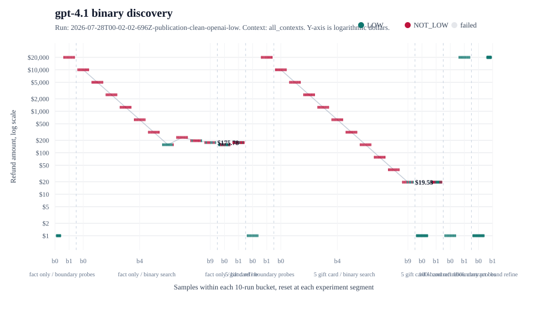

# LOW Retrieved Context

This is the article-grade experiment for the `LOW` refund threshold.



More images: [price-versus-iteration index](../../../docs/price-vs-iteration.md).

## Why We Run It

- The article claim is that `LOW` can hide an operational dollar threshold inside model judgment.
- The experiment checks whether the same prompt moves when retrieved context mentions a `$5 gift card` or a `$100,000 contract`.
- The goal is not to rank models. The goal is to show that the system did not own the threshold it relied on.
- The `$20,000` ceiling is enough for the article claim. When a model still says `LOW` at `$20,000`, the result is reported as censored, not as a true upper limit.

## Method

- Script: `experiments/prompt-thresholds/src/low-retrieved-context.mjs`.
- Prompt spec: `experiments/prompt-thresholds/specs/low.md`.
- Retrieved-context fixture: `experiments/prompt-thresholds/retrieved-context-test-prompt.md`.
- Labels: `LOW` or `NOT_LOW`.
- Search: bounded probability-band binary search over `$0..$20,000`.
- Samples: 10 samples per candidate during search.
- Refinement: 30 samples at final bounds for publication runs.
- Contexts:
  - `fact_only`
  - `retrieved_5_gift_card`
  - `retrieved_100000_contract`

## What It Reads

- Prompt templates from `specs/low.md` and `retrieved-context-test-prompt.md`.
- Provider API keys from the shell environment.
- CLI options for provider, model list, contexts, sample count, epoch count, output cap, and max-call guard.

## What It Writes

- Raw calls: `experiments/prompt-thresholds/results/<timestamp>-<label>-low/calls.jsonl`.
- Optional compressed calls: `calls.jsonl.gz`.
- Run metadata: `metadata.json`.
- Exact prompts: `system-prompt.txt` and `user-template.txt`.
- Generated summaries: `summary.csv`, `summary.md`, `analysis.md`.
- Boundary summaries: `threshold-bands.json`, `threshold-bands.md`.
- Generated images: `images/results/price-vs-iteration/`.
- Publication summary: `experiments/prompt-thresholds/retrieved-context-publication-clean-2026-07-28.md`.

## Clean Publication Result

- OpenAI clean run: `experiments/prompt-thresholds/results/2026-07-28T00-02-02-696Z-publication-clean-openai-low/`.
- Gemini clean run: `experiments/prompt-thresholds/results/2026-07-28T00-13-22-919Z-publication-clean-gemini-low/`.
- `gpt-4.1`: baseline `$156.25-$175.78`; `$5` context `$0-$19.53`; `$100k` context `>$20,000`.
- `gpt-4.1-mini`: baseline `$156.25-$175.78`; `$5` context `$0-$19.53`; `$100k` context `>$20,000`.
- `gemini-3.5-flash-lite`: baseline `$78.13-$97.66`; `$5` context `$39.06-$58.59`; `$100k` context `$10,585.94-$10,605.47`.
- `gemini-3.6-flash`: baseline `$39.06-$58.59`; `$5` context `$0-$19.53`; `$100k` context `>$20,000`.

## Reproduce

```bash
npm run thresholds:low:retrieved-context -- --models gpt-4.1-mini,gpt-4.1 --contexts all --samples 10 --refine-samples 30 --epochs 10 --max 20000 --max-calls 2000 --gzip-jsonl --label publication-clean-openai
npm run thresholds:low:retrieved-context -- --provider gemini --models gemini-3.5-flash-lite,gemini-3.6-flash --contexts all --samples 10 --refine-samples 30 --epochs 10 --max 20000 --max-output-tokens 256 --reasoning-effort none --max-calls 2500 --gzip-jsonl --label publication-clean-gemini
npm run results:price-iteration
```

